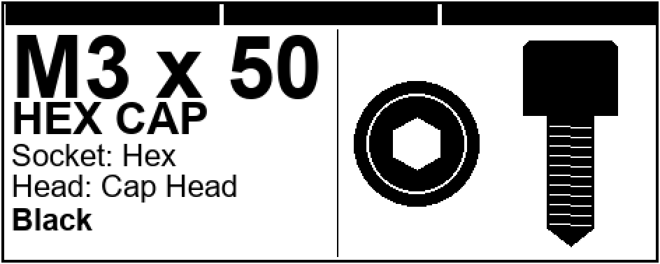

# Label Generator

> Flask-based web application for creating and printing screw/fastener labels for toolbox organizers.


## Features

- **Interactive Label Maker**: Filter, select, and print labels for metric screws (M2-M6)
- **Color Code Reference**: Visual chart showing the color coding system for screw sizes
- **Custom Labels**: Create labels for non-standard size/length combinations (saved to localStorage)
- **Print-Ready Output**: Optimized for US Letter (8.5×11") at 300 DPI
- **Self-Contained**: Each tool includes all CSS/JS inline - no build step required

## Screenshots



## Label Layout

Each label (40×16mm @ 300 DPI = 472×189px) includes:
- Top bars indicating M size (1 bar = M2, 2 bars = M2.5, ... 6 bars = M6)
- Size × Length (e.g., `M3 x 50`)
- Drive type and head type
- Material (Black or Stainless with appropriate styling)
- Top-down and side profile drawings

## Installation

```bash
# Clone the repository
git clone https://github.com/James-Hendershott/Label_Generator.git
cd Label_Generator

# Create virtual environment
python -m venv .venv
source .venv/bin/activate  # Linux/Mac
# .venv\Scripts\activate   # Windows

# Install dependencies
pip install -r requirements.txt

# Run the application
python run.py
```

The app runs on `http://localhost:5000`.

## Project Structure

```
Label_Generator/
├── run.py                  # Flask entry point
├── app/
│   ├── __init__.py         # App factory
│   └── routes.py           # Route definitions
├── templates/
│   ├── index.html          # Landing page
│   ├── label_maker.html    # Interactive label maker
│   └── color_code.html     # Color code reference chart
├── static/
│   └── output/             # Generated labels (gitignored)
├── assets/                 # PDF exports and previews
└── preview_label.py        # Label layout prototyping script
```

## Routes

| Route | Description |
|-------|-------------|
| `/` | Landing page with links to tools |
| `/labels` | Interactive label maker |
| `/color-code` | M2-M6 color code reference |

## Tech Stack

- **Backend**: Python, Flask
- **Frontend**: Vanilla HTML/CSS/JavaScript (self-contained)
- **Label Generation**: Canvas API (browser-side)

## Next Steps / Roadmap

### High Priority
- [ ] **Server-side label generation** - Replace browser canvas with Pillow/ReportLab for consistent output
- [ ] **API endpoint** - `/api/generate-label` for on-demand label creation
- [ ] **Batch export** - Generate multiple labels as PDF in one action

### Medium Priority
- [ ] **Database integration** - Track inventory and label print history
- [ ] **Label templates** - Save/load custom label configurations
- [ ] **QR code support** - Add QR codes linking to inventory system

### Low Priority
- [ ] Extract inline CSS/JS to separate static files
- [ ] Add dark/light theme toggle
- [ ] Improve mobile responsiveness
- [ ] Integration with Where's My App inventory system

## Origin

This project was migrated from standalone HTML files originally hosted on an Unraid server for personal toolbox organization.

## License

MIT
